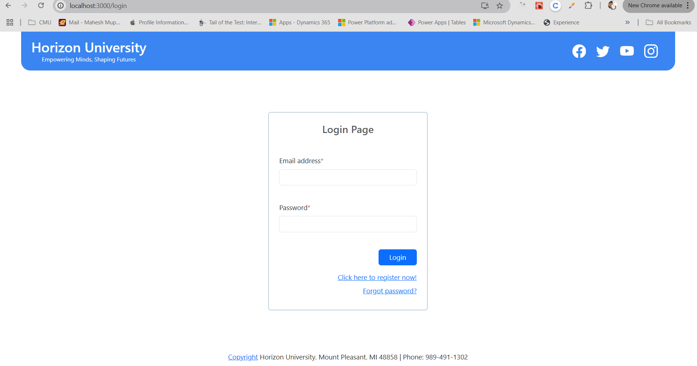
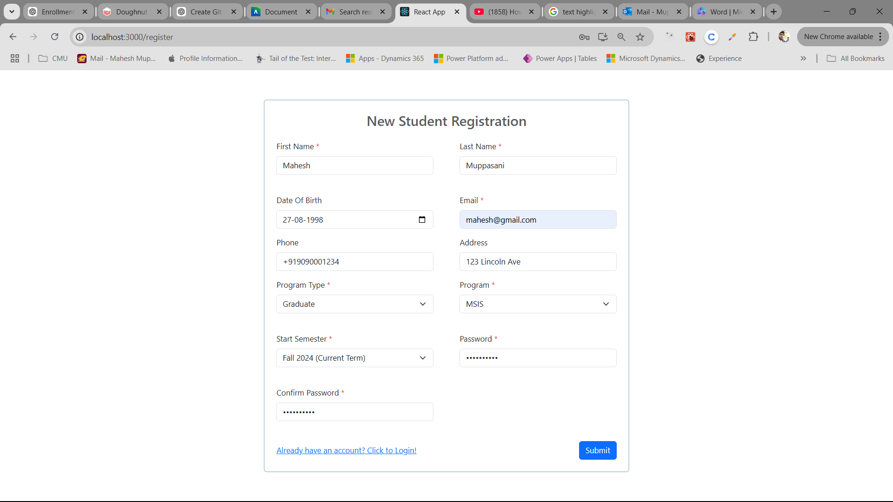
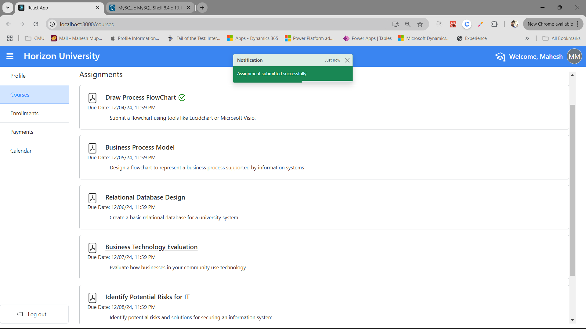
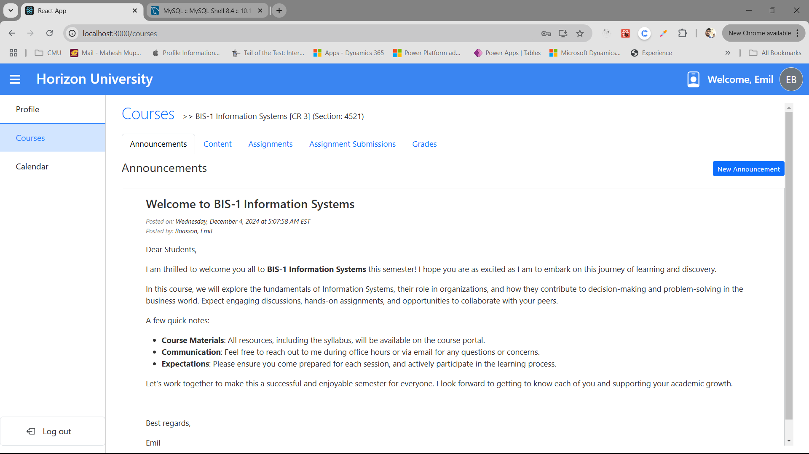

# Login Credentials
- Access the website here: https://um-client.vercel.app/
- Admin Login: 'surabhi@gmail.com'. At present, only one admin was registered into the system. Future scope will include many features including the 'Users' tab into the admin portal where admins can manage multiple users.
- Password for all existing users including the admin is: 'Mahesh@007' 

# ER Diagram

# DFD – Context Level

# DFD – Level 0

# DFD – Level 1

# User Roles

## Student Role 

- Students are users in the system with the necessary permissions to
  register through the system.

- They can enroll for a course and access the course information posted
  by the respective faculty members.

- They can submit assignments and access faculty provided feedback for
  their learning purpose.

- All their grades and CGPA are calculated automatically at the end of
  the semester by the system.

## Faculty Role

- Faculty are the users in the system with the necessary permissions to
  teach courses to the student users.

- Faculty members are added to the system by the administration team
  after they receive a list of qualified faculty members from the HR
  department of the university.

- Faculty users can be assigned teaching sections by the administrators
  of specific departments to instruct the students.

## Admin Role

- Admin users are supervised users who can access all the system’s
  information and can read or write them with necessary permissions.

- Admins can add other admins and faculty. They can edit or delete all
  the information of different users.

- Admins can run reports like semester enrollment reports and can
  process end-of-semester audits in the system.

**  
**

# Login View

The login page is commonly used for all the roles of users. Based on the
credentials users provide on this page, the system will determine the
role of the user by checking the email address in the database.

Login Page View

**  
**

## Login Page Validations

The login page has essential validations to prevent faulty data from
being entered into the system.

No email or password validation

Not found email address validation

Incorrect password validation

## Sample Login Demonstration (Admin Role)

## 

Admin login information

Admin view after successful login (for demonstration) & Main Dashboard
View

# Student View

## New Student Registration

Option for new student registration

New student registration view

Page validations

New Student Registration Information

Successful registration feedback

## Student Profile Page

Once the user registered, the system will bring the user to the login
page to login using their credentials.

Student Profile View

## Course Enrollments Page

Course
Registration / Enrollments Page

Current Semester and Future
Enrollments

### Page Validations

Course
Search form validations

No search results message view

Fall 2024, the current semester, has no teaching sections under the
Business Information Systems Department.

Refer the section ‘Admin View \>\> Course Dashboard’, in the table of
contents to know how an administrator creates a teaching section.

**<u>  
</u>**

### Course Enrollment Process

Refreshing the page or by searching again, will fetch the newly added
teaching section following the search criteria.

Enrollment view after enrolling a teaching section

Once the student clicks on ‘Enroll’ button, the course will be enrolled.
The drop or enroll option will be allowed until the Enroll/Drop deadline
is passed.

Current and future enrollments view after enrolling a course

All the enrolled courses will be shown in Current and Future Enrollments
tab grouped by semesters.

Let us add few more enrollments for this student.

Enrollment limit feedback

**Business rule 1:** for Horizon University: Students can only enroll
for a maximum of 3 courses for a semester. If a student tries to enroll
beyond this limit, an error will be shown to students.

However
student can change the term to Spring 2025 to see if any other courses
available.

Since this student has already enrolled for all three courses that are
on the top, they aren't enabled for enrollment, but they have an option
to retake the course (Request option), which is not implemented as it
will be considered as future scope. However, he can enroll for the
following three courses for Spring 2025.

Current
and future enrollments view

Current and future enrollments view after drop or enrollment deadline is
passed

**Business rule 2:** Once the drop deadline is passed the enrollments
cannot be added or dropped

Course search view after enrollment or drop deadline is passed

If a new student enrolls (Jane, In this example) at this point where the
enrollment / drop deadline ends, they can view the teaching sections but
cannot enroll for them as shown in the picture below. Again, the request
option is just there as a placeholder to show its future purpose.

Request a course feedback

## Student Courses Page

Student Courses View

Let us go back to the student mahesh@gmail.com. Under the ‘Courses’ tab,
they can view all the enrolled courses for the current semester. If
there are any previous terms that they had, all those completed terms
will be listed down as shown in the account below (under student Emily,
student306@gmail.com).

Courses page view for previous semester terms

Going back to the student account \`mahesh@gmail.com\`, for the
demonstration of course teaching page. The course page has 4 different
tabs for students:

1.  Announcements

2.  Content

3.  Assignments

4.  Grades

### Course Announcements 

Once a faculty posts an announcement, students can view them under this
tab. Currently, for this teaching section, the faculty had already
posted a welcome announcement.

course
announcements page

### Course Contents 

Under this tab, students can view all the course content posted by the
instructor.

Course Content Page

There are five different content types for a course. Those are as
follows:

1.  Text

2.  Folder

3.  URL Link with a text

4.  File

5.  Assignment

**1. Text:** Any content that has a text file icon as highlighted in the
below image is a text content. By default, the content is sliced to show
only a portion of it to save space. It can be clickable to open in a
separate page to view its information in detailed.

Text type content (Not opened)

Text Type content (Opened)

A back button is provided to navigate back into its previous directory
or the user can be able to click the breadcrumbs (Courses
\>\> BIS-1 Information Systems \[CR 3\] (Section: 4521) \>\> Course
Syllabus) on top to go directly into that directory.

**2. Folder:** Any folder that has a folder icon as highlighted in the
image below is folder content. A folder can accommodate any type of
course content (i.e. Text, another Folder, URL Link content, or a File)
and can be nestable. Assume it as a folder in our computer, we can
create N number of folders or files in it. Folders can be nested meaning
they can go to N number of levels by nesting folders inside them. Thanks
to a self-referencing table \`Course_content\` to achieve this behavior.

The table Course_content schema is given below:

course_content table schema

In an up-opened form, the folder slices the text information inside it
to save space. It can be clickable to open in a separate page to view
all the information inside it.

Folder type content (Not opened)

Folder type content (Opened)

For this demonstration, the folder Week 1, has some text showing on top
of the page and any other content inside it will be showed under the
text.

Nested folder (Assignments) inside a parent folder (Week 1)

**3. URL Link with a text:** Any content with a link icon as shown in
the below image is a URL Link content. The title hosts an external
website’s URL to open in a new browser tab. It cannot be opened in a new
page to view its text information. So, the application has necessary
validations while creating this content to ensure that the text
information met the length constraints.

URL Link content

**4. File Content**: A content which has a pdf icon as shown in the
image below is either file content or an assignment. File content can be
distinguished from assignment as it don’t contain any deadline
information like an assignment. File contents are generally designed to
host a file and some text information about the contents of the file.
Users can download the files attached in this content. Current
limitations are it can host a single file and some text. The feature
multiple file hosting in this content is taken as a future scope.

File contents can be opened to view their text information in full as
well as its files.

File content (un-opened view)

File content (opened view)

**5. Assignment Content:** Any content that has a pdf icon and a due
date as shown in the image below is an Assignment Content.

Assume the assignment content is a superset of file content. It has all
the features of a file content and additionally, it has its own set of
data such as deadline (A date and time), number of attempts, maximum
assignment score, faculty posted instruction files and text, student
posted submission files and text and faculty uploaded feedback files or
text. It can be clickable to open a new page where students can submit
the assignment, and faculty can grade them further.

Assignment content(un-opened)

Assignment content (opened)

### Course Assignments 

Students can find all the assignments posted under this tab. They might
be originally posted in any folder level or main content level. This tab
helps students to find the assignments all in one place.

Course Assignments page

Students can navigate to assignments tab to quickly find all the
assignments or to their respective parent content such as assignment
folder (in our example) to submit an assignment.

Assignment submission view

Once the student submits an assignment, it will show the following
message, and the status of the submission is shown as tick icon on the
corresponding assignment.

Successful submission

### Course Grades

The grades tab contains the detailed status of all the assignments. The
information such as assignment name, due date, status of the assignment,
grade received, and faculty provided feedback (if any).

Grades tab view

## Calendar Page

The calendar module embedded in the student portal is an external
website (<https://calender-app-v2.web.app/>) developed by one of the
team members of this project. The website has equipped necessary
validations and security that can be embedded into the Horizon
University’s portal by leveraging the use of an iframe. Iframe is a
browser’s API that allows us to embed external applications into the
parent application (Horizon university portal). The communication
between this calendar module and University portal is established
through \`postMessage\` API which is a web browser’s built-in API.

This calendar module helps students to track all their assignments of
all the courses they have enrolled in. If a student has any deadline for
any course that he enrolls in, the calendar module will show all those
assignments of that course in the respective calendar dates shown in the
below image. Anything that is showing up in this calendar date’s cell
will be termed as ‘event’. The image below shows up all assignment
events that the student had for BIS-1 course. The calendar right side
pane will show all the events of that date since the date-cell cannot
accommodate more than 3 events in it. But it will show ellipses (3 dots)
when they overflow to represent that the date has more events underlying
it. Users can click these date-cells to view all those events in the
events pane.

Calendar module

Users can click an event to view its information more. Below image
showing up the BIS-1 course’s assignment \`Draw Process Flowchart\`.
This tab has a few limitations that it can show only the course code,
assignment name, due date and assignment instructions. More features
like showing up the attempt count left, grade received, submitting the
assignment there itself or navigating to the respective assignment
submission page are taken into consideration in future scope.

Calendar assignment event (opened)

# Faculty View

Now that a student submits an assignment, let us quickly navigate into a
faculty portal to see how the course module looks and how they can grade
the students.

## Faculty Profile

To demonstrate the course teaching process such as posting course
content, assignments, grading we need to look at the faculty portal. Let
us login as faculty emil@gmail.com:

Faculty login information

Successful faculty login

## Faculty Courses

Faculty portal is made simple with only a profile, courses and calendar
options. Let us view the faculty courses tab:

Faculty courses view

All the current and coming up courses they have taken are shown on this
page grouped by semester. The teaching section 4521 for BIS-1
Information system shows total enrollment count as ‘1 / 10’. The student
\`mahesh@gmail.com\` is the only enrolled student as of now out of 10
seats.

There are 5 tabs for faculty’s course module. They are as follows:

1.  Announcements

2.  Content

3.  Assignments

4.  Assignment Submissions

5.  Grades

### Course Announcement

Tabs 1, 2, 3 look alike for students or faculty but faculty can post the
announcements, post the teaching content and assignments and can grade
them. In this example, the faculty, emil, has already posted a welcome
announcement for their students.

Faculty Announcements view

Faculty can add an announcement by clicking on the ‘New Announcement’
Button under the announcement tab. They can add a announcement subject
and message as shown in the image below:  

Faculty new announcement view

Faculty view for successful announcement post

### Course Content management

Faculty have privilege to edit or delete any course content such as
Text, Folder, URL Link content, File and Assignment content. The ‘Add
New’ dropdown button under the content tab can be useful to add any
course content or assignments. ‘Options’ dropdown button can be useful
to edit or delete any course content or assignments.

Course content view

Faculty can add course content by clicking on the ‘Course Content’
button under the ‘Add New’ dropdown button as shown in the image below.

Add New Course Content option for faculty

Faculty can add any type of content as we described earlier using this
view except assignments. They can choose a content type from the
dropdown.

Add New course content view

Choose content type option

Text and Folder content share the same form structure but the only
difference is folders can act as containers to other types of content as
we discussed earlier. URL link content has an extra column ‘Title URL’
that will display dynamically (as shown in the image below) when the
user selects the ‘Text with title URL’ option from the drop-down.

URL link content view

File content can be added by selecting the file option from the
drop-down. The respective file picker input will show up dynamically (as
shown in the image below) when the user selects this option.

Add File content view

Let us add a folder content in the main level with some dummy
information. By default, user can add a text for the folder creation.

Adding course folder content information

Users can add nested contents into the folder by selecting it once upon
successful creation. The newly created folder will be shown under all
other contents as shown in the image below:

Successful content creation view

If the content that is opened is a folder type, the ‘Add New’ drop-down
button will be displayed just like in the main content level. For all
other content types, this feature would not be there as they are not
nestable content type like a folder. In this example, the newly added
folder ‘Week 3’ has only text information for now. Faculty can now add
any type of content or assignment in it.

Newly created folder content view

Faculty can edit or delete the content by going into its main directory
(but not in its open view). Any further improvements in this logic such
as editing the content or deleting it when it is in open view are
considered for future scope.

Content Edit option

Content Edit View

Let us update the title to ‘Week 3: Data Analytics’ and save the
content.

Content Edit Feedback view

Faculty can delete the content by selecting the respective option in the
‘Options’ drop-down menu.

Content delete option view

Before deleting any content, there are some things to note that if a
folder is deleted all its nested contents (of any type described
earlier) and its text data are permanently deleted, and this process is
irreversible. The concept of soft deletion will be considered in future.
Thanks to the cascading effect of MySQL table schema, if any folder
content is deleted, all other contents that are nested inside it will be
deleted effortlessly.

Content delete prompt

Now, if the folder is deleted, it no longer exists in the system and the
page will be refreshed accordingly (as shown in the image below).

Successful content deletion view

Let us now focus on how a faculty creates an assignment. Users can add
an assignment in any directory as they wish. For the sake of
demonstration, let us choose an existing folder ‘Week 2 \>\>
Assignments’. User can select the ‘Course Assignment’ button under ‘Add
New’ dropdown to add an assignment into that folder.

Create Assignment option view

Add Assignment View

By default, the time input will be filled with ’23:59:59’ as a military
time and this is because most of the assignments are created for end of
the day due. Let us add a test assignment named ‘Individual Effort
Evaluation’ with some test data.

Add assignment view (sample information)

After hitting ‘Add Content’ the newly created assignment will be shown
in the respective folder as shown in the image below.

Assignment created feedback

The editing of course assignment is straightforward as other content
types.

The only drawback in this content management page is that users have no
choice on the content order. This will be considered for future and the
potential solution will consists of a draggable option on the content to
re-arrange them.

### Assignment Submissions 

This is a feature tab solely for faculty where all the students
submitted assignments will be displayed (as shown in the image below).
Currently, only one student (mahesh@gmail.com) is submitted the
‘assignment1’ as shown earlier. The table will show the student
information, assignment information, submission information, grading
status, and score. submissions that are on-time are highlighted in green
with ‘On Time’ text whereas late submissions are highlighted in red with
'Late’ text. Student scores will be displayed once the grade is posted
by faculty else ‘Not Graded’ will be displayed.

Assignment submissions tab view

Faculty can filter through various assignments by selecting an
assignment in the search options provided. They can filter through the
assignment status as well or by searching student name.

Assignments that were posted for that teaching section will be displayed
(as shown in the image below) to filter through the submissions.

Assignment filter view

Assignment status filter view

Search bar will be used to search by student name, email address, or
assignment name. Search will be made along with other filters through
AND logic.

Assignment submission search

Faculty can select any submitted assignments by students to grade them.
Let us select the only submitted assignment to grade that submission.

Selecting the submitted assignment

Assignment grading view for faculty

Users can collapse or expand the submission details, faculty grading
(only visible to faculty to post the grades and feedback) and assignment
instructions.

Assignment page (information collapsed view)

Let us grade this student submission by inputting some test information.

Faculty Grading and Feedback view

After posting the grade and feedback, the assignment page will be closed
and navigated back to the submissions page where the updated information
(student grade) will be displayed.

Successful Grading

If the faculty already graded an assignment and opened it again, the
respective grade score, feedback written or any files uploaded for
feedback will be displayed as showed in the picture below. This screen
will be same both for faculty and students.

Graded Assignment View (for faculty and students)

### Course Grades Page 

This tab shows the detailed status of the submissions and assignments
status. A class average will also be shown to give some insights to
faculty about the student performance. If at least one student receives
a grade the class average will be displayed for that assignment as shown
in the image below.

Faculty grades tab view

Let us add few more enrollments to this course for the demonstration.

Assignment submission’s view

Faculty grades tab

# Admin View

Administrator (Admin) users have access to all the other users
(students, faculty), all the courses, teaching sections, programs, and
other administrators.

Admin Portal View

## Charts Dashboard

Dashboard has integrated with better insights with visualizations for
admins such as:

### Percentage of students completing courses over time - Line chart:

1.  This visualization shows the percentage of students who successfully
    completed their courses across different semesters.

2.  Each line represents a specific course or program, and the y-axis
    displays the percentage of students completing the course, while the
    x-axis represents semesters over time.

**How It Helps Admins:**

- Identify trends in course completion rates and spot declining or
  improving courses.

- Determine in which courses students are struggling to succeed and
  which need improvement.

- If a course has consistently low completion rates, it may require
  additional resources, better faculty support, or curriculum redesign.

### New Students Enrolled or Registered by Semester – Bar Chart:

1.  This chart shows the number of new students registered in each
    semester.

2.  The y-axis represents the number of students, and the x-axis
    represents the semesters.

**How It Helps Admins:**

- Track the success of recruitment campaigns by analyzing spikes or
  drops in student registrations.

- Identify trends in enrollment for specific semesters (e.g., more
  enrollments in Fall vs. Spring) and plan recruitment efforts
  accordingly.

- Understand whether recent programs or initiatives impact the
  enrollment of new students.

- Adjust admissions targets, financial aid offerings, or marketing
  strategies based on semester-by-semester data.

### Bar Chart Showing Most Enrolled Courses by Semester:

1.  This chart highlights the top courses with the highest student
    enrollments for a particular semester or across multiple semesters.

2.  The x-axis lists the courses, and the y-axis shows the number of
    students enrolled.

**How It Helps Admins:**

- Identify which courses are in high demand and which might require
  increased capacity or additional sections.

- Use enrollment trends to design future curriculum and prioritize
  popular courses while phasing out underperforming ones.

- Assign experienced faculty or increase faculty hiring for highly
  enrolled courses.

###  Pie Chart Showing Student Strength by Programs

1.  This visualization divides students into their respective programs
    and shows the proportion of students enrolled in each program.

2.  Each slice represents a program, with the size proportional to its
    student strength.

**How It Helps Admins:**

- Assess the popularity and strength of various programs briefly.

- Allocate budgets, faculty, and resources proportionately to programs
  based on their student strength.

- Spot programs with disproportionately low enrollments and investigate
  why they are less appealing to students.

## Course dashboard

This dashboard helps admins to find different department courses in one
place. They can apply filters such as department, program, program type
(graduate level, undergraduate level etc.) and can even search using
course name, department name and program name.

Courses dashboard view

### Add New Course

Admins can add a course by clicking on the ‘Add New Course’ button and
the course creation view is as follows:

Create new course view.

Admins can edit a course by clicking ‘Quick Edit Course’ button under
options drop-down.

### Edit a course

Course Edit Option View

Course Edit View

The important fields for a course are shown in the create and edit views
of a course. Admin can add a course, can select it as program required,
can edit course credits, department to which this course belongs to,
program type, program, pre-requisites of that course (maximum of five
pre-requisites can be selected) and finally course description.

### Delete a course

Admin can choose to delete a course by clicking on ‘Delete Course’
option as shown below. Deleting a course can potentially delete all the
course information, teaching sections for that course, the respective
enrollments, student’s course progress and everything that is associated
with that course.

In future scope, we will take precautions while deleting a course such
as requiring an administrator’s password to prevent only the authorized
persons can be able to modify the course information. There might be
scenarios that if the administrator might go away from the computer, and
no other person can perform this action unless they know the password.
The same will apply for updating the course.

Along with that, there should be a way to let the admin know that this
course has active teaching sections going on and the respective student
enrollments. All these things will be taken into consideration in future
scope of this project.

Course Delete Option View

Delete course prompt view

### Add New teaching section

Let’s select BIS-1 i.e., Information Systems course in the program MSIS
of Business Information Systems Department.

Course details page where course teachings will be listed down
(currently no teaching sections yet). Let us create a teaching section
for this course by clicking the new teaching section button.

Add new teaching section view

By default, student's enrollment option is enabled, and the admin can
disable it by toggling it. The main purpose is, if the admin disables
it, this teaching section will not be visible under the search results
in the student’s enrollments tab.

Admin can choose a faculty from a particular department, i.e., BIS and
can select the delivery mode for the semester for the teaching section
to be enrolled and can add the capacity for them.

Newly created teaching section is showing up in the page

Admin can select a section to view its details such as faculty and
enrolled student list.

Teaching Sections View

Teaching section information view

### Edit a teaching section

Teaching section edit option

Edit teaching section view.

## Program Dashboard

Admin can use this dashboard to manage the existing programs. They can
utilize the search and filter options provided to find the desired
programs efficiently.

Program Management Dashboard

### Add new program

Admin can add a new program to the university by clicking on the ‘Add
New Program’ button on top.

Create New Program View

### Edit a program

Edit Program Option view

Edit Program View

### Delete a program

Delete Program Option

Delete Program Prompt View

## Faculty Dashboard

Admins can use this dashboard to manage the faculty of all the
departments. They can add new faculty and can manage their existing
basic information. They can reset passwords of faculty as well.

Faculty Management Dashboard

### Add new faculty

Admin can click on the ‘Add New Faculty’ to add a new faculty member.
They can set an initial password while creating the new faculty member.

Add New Faculty View

### Edit a faculty

### 

Faculty Edit Option

Edit Faculty View

### Remove faculty

### 

Remove Faculty Option

## Semester End Audit

### Semester end overview

In general, university systems are equipped with an automated process of
ending semesters by running an audit internally and start up new
semester. This audit makes sure that the grades were received from the
faculty for the student enrolled courses, updates the students’
progress, run financial reports and other system checks.

For this, the system must be configured in such a way that the database
creates future semester terms automatically. When the end of the
semester arrives, this process runs the audit to verify if all the
teaching sections enrolled by students did post grades, and update or
save the course progress and finally this audit changes the semester in
the system.

For the purpose of this project and demonstration, the current system
hasn’t configured with the features of automation we discussed above.
So, the administrator has a manual control to run this audit and change
the semester. Admins can process this audit by clicking on the ‘End
Semester Audit’ on the left side menu.

End Semester Audit View

This view is configured to let the admins know what is happening in a
stepwise manner listed below:

**Step-1 Check Grade Status:** The first step of this audit before
ending the semester and changing it to a new term is to check whether
all the grades are posted by the faculty for the respective courses
enrolled by students. If yes, the process will move to step 2.

**Step-2 Update Course Progress:** The second step of this audit is to
update the course progress of students. Assuming the initial progress of
any new enrollments is NULL, this step will save the course progress by
checking the grades received of individual enrollments. Once all the
enrollments’ course progress is updated, the sub process step 2 will be
completed, and the next process will be overseen by step 3.

**Step-3 Save Student Progress & Change Semester:** This sub process of
the audit takes all the updated course progress of student enrollments
and calculates the student’s GPA for the end of the current semester.
Once all the students’ Cumulative GPA is processed, this step makes sure
it updates the system to move to next semester. This step also ensures
that it creates a new semester if there are not any.

In general, the administrator should make sure that all the faculty
staff have posted their students’ grades. In future scope of this
project, we will take measures to implement such features that
administrators can know what teaching sections are not yet posted grades
by the end of the semester. For now, step 1 will take care of this
measure by checking through all the current semester’s enrollments. If
at all an administrator does not want to end the semester but if they
just want to check if all the grades are posted, they can run the first
step and close the process.

Let us now start the end of the semester audit and see what this process
will show to the user.

The process got stopped due to an error in step 1 that is one or more
teaching sections did not received grades for the respective students
and the detailed error log is shown in the view. This error occurred
because no faculty has posted grade for their sections yet.

Fall-2024 semester has a total of five teaching sections for 4 different
courses. Those are:

1.  BIS-1 (Section 4521 and 4534)

2.  BIS-2 (Section 4522)

3.  BIS-3 (Section 4523)

4.  BIS-4 (Section 4524)

Let us consider the teaching section 4521 for posting grades for
students. The ‘grade_received’ column in enrollment table will save this
grade information once the faculty post grades. This value is calculated
based on the weighted percentage score of the student of all their
respective assignments. Below is the implementation of grade calculation
function and grade honor points look up.

<table>
<colgroup>
<col style="width: 100%" />
</colgroup>
<thead>
<tr>
<th>
const isValueInRange = (value, min, max) =&gt; {

    if (min &lt;= value &amp;&amp; value &lt;= max + 0.99)
<em><strong>return</strong></em> true;

    <em><strong>return</strong></em> false;

}

<em>export</em> const gradeForWeightedPercentage = (percentage) =&gt;
{

    if (isValueInRange(percentage, 94, 100))
<em><strong>return</strong></em> 'A';

    else if (isValueInRange(percentage, 90, 93))
<em><strong>return</strong></em> 'A-';

    else if (isValueInRange(percentage, 87, 89))
<em><strong>return</strong></em> 'B+';

    else if (isValueInRange(percentage, 84, 86))
<em><strong>return</strong></em> 'B';

    else if (isValueInRange(percentage, 80, 83))
<em><strong>return</strong></em> 'B-';

    else if (isValueInRange(percentage, 77, 79))
<em><strong>return</strong></em> 'C+';

    else if (isValueInRange(percentage, 74, 76))
<em><strong>return</strong></em> 'C';

    else if (isValueInRange(percentage, 70, 73))
<em><strong>return</strong></em> 'C-';

    else if (isValueInRange(percentage, 67, 69))
<em><strong>return</strong></em> 'D+';

    else if (isValueInRange(percentage, 64, 66))
<em><strong>return</strong></em> 'D';

    else if (isValueInRange(percentage, 60, 63))
<em><strong>return</strong></em> 'D-';

    else if (percentage &lt; 60) <em><strong>return</strong></em>
'E';

    else <em><strong>return</strong></em> null;

}

<em>export</em> const gradeHonorPointsLookUp = {

    'A': 4,

    'A-': 3.7,

    'B+': 3.3,

    'B': 3.0,

    'B-': 2.7,

    'C+': 2.3,

    'C': 2.0,

    'C-': 1.7,

    'D+': 1.3,

    'D': 1.0,

    'D-': 0.7,

    'E': 0.0

}
</th>
</tr>
</thead>
<tbody>
</tbody>
</table>

Enrollment Table schema

Query to retrieve all the enrollments of section 4521

Enrollments of section 4521 (ungraded)

Let us now look at how a faculty can post grades for his teaching
section (in our example section-4521).

### Post section grades (faculty view)

Faculty portal has one more essential feature that we have not discussed
earlier, which is the post section grades. The faculty grades tab has a
button called ‘Post Grades’ feature to post all the section grades as
shown in the image below. Once faculty posts all grades, the system
executes the grade calculation process for the respective enrollments.

Faculty grades table view

The relevant program or logic to handle this process is shown in the
snippet <u>courseGradesTab.js</u> (front-end) and the server has the
following code to process this request.

<u>postAllSectionGrades-PUT Request (Server / Backend API):</u>

<table>
<colgroup>
<col style="width: 100%" />
</colgroup>
<thead>
<tr>
<th>
exam_router.put("/postAllSectionGrades", authenticateFaculty,
<em>async</em> (req, res) =&gt; {

    const { sectionId } = req.body;

    if (!sectionId) {

        res.status(400).send('Please provide a section Id');

        <em><strong>return</strong></em>;

    }

    const allExamsStatus = <em><strong>await</strong></em>
getAllSectionExamsStatus(sectionId);

    if (allExamsStatus) {

        if (allExamsStatus.every(exam =&gt; exam.students_graded ===
exam.students_attempted)) {

            let studentGrades = []

            allExamsStatus.forEach(exam =&gt; {

                let { grades_array, MaximumScore } = exam;

                grades_array = JSON.parse(grades_array);

                grades_array.map(grade =&gt; {

                    const { student_id, grade_received } = grade;

                    const index = studentGrades.findIndex(sa =&gt; sa
&amp;&amp; sa.student_id === student_id)

                    if (index !== -1) {

                        studentGrades[index].student_total +=
grade_received;

                        studentGrades[index].max_total +=
MaximumScore;

                    } else {

                        studentGrades.push({

                            student_id,

                            student_total: grade_received,

                            max_total: MaximumScore

                        })

                    }

                })

            })

            if(!studentGrades.length){

                res.status(400).send('No Student Grades To
Post');

                <em><strong>return</strong></em>;

            }

            <em>// logic continues to post the grades</em>

            studentGrades = studentGrades.map(studentScore =&gt;
{

                const { student_id, student_total, max_total } =
studentScore;

                const weightedPercentage = (student_total /
max_total) * 100;

                const Grade =
gradeForWeightedPercentage(weightedPercentage)

                <em>// const GradeHonorPoints =
gradeHonorPointsLookUp[Grade];</em>

                <em><strong>return</strong></em> {

                    student_id,

                    grade: Grade,

                }

            })

            const bulkResponse = <em><strong>await</strong></em>
postSectionGrades(studentGrades, sectionId);

            <em>// console.log(bulkResponse)</em>

            res.send('All grades posted');

            <em><strong>return</strong></em>;

        } else {

            res.status(400).send('One or more students needs to be
graded!');

            <em><strong>return</strong></em>;

        }

    } else {

        res.status(500).send('Something went wrong! please try
again');

        <em><strong>return</strong></em>;

    }

})
</th>
</tr>
</thead>
<tbody>
</tbody>
</table>

<u>getAllSectionExamsStatus (Query Handler):</u>

<table>
<colgroup>
<col style="width: 100%" />
</colgroup>
<thead>
<tr>
<th>
<em>export</em> <em>async</em> function
getAllSectionExamsStatus(sectionId) {

    let query = `SELECT

                e.ExamID,

                e.MaximumScore,

                COUNT(DISTINCT es.submission_id) AS
students_attempted,

                COUNT(DISTINCT CASE WHEN es.grade_received IS NOT
NULL THEN es.submission_id END) AS students_graded,

                (

                    SELECT COUNT(*)

                    FROM Enrollment en

                    WHERE en.SectionID = e.SectionID

                ) AS total_students,

                CONCAT("[",

                    GROUP_CONCAT(

                        JSON_OBJECT(

                        'student_id', en.StudentID,

                        'grade_received', CASE

                            WHEN EXISTS (

                                SELECT 1

                                FROM Exam_Submission es_sub

                                WHERE es_sub.exam_id = e.ExamID

                                AND es_sub.student_id =
en.StudentID

                            ) THEN COALESCE(es.grade_received, 0)

                            ELSE 0 END

                                )

                    ),

                "]") AS grades_array

            FROM Exam e

            LEFT JOIN Enrollment en on en.SectionID = e.SectionID

            LEFT JOIN Exam_Submission es ON e.ExamID = es.exam_id AND
en.StudentID = es.student_id

            WHERE e.SectionID IN (

                SELECT Section_ID

                FROM Section s

                WHERE s.SemesterID = (

                    SELECT semester_id

                    FROM Semester

                    WHERE is_current_semester = 1 AND e.SectionID =
?

                )

            )

            GROUP BY e.ExamID`

    const [rows] = <em><strong>await</strong></em> pool.query(query,
sectionId);

    <em><strong>return</strong></em> rows;

}
</th>
</tr>
</thead>
<tbody>
</tbody>
</table>

<u>postSectionGrades</u> (Query handler to post the section grades):

<table>
<colgroup>
<col style="width: 100%" />
</colgroup>
<thead>
<tr>
<th>
<em>export</em> <em>async</em> function postSectionGrades(grades,
sectionId) {

    let query1 = `

    DROP TEMPORARY TABLE IF EXISTS TempGrades;

    CREATE TEMPORARY TABLE TempGrades (

        StudentID INT,

        grade_received ENUM('A', 'A-', 'B+', 'B', 'B-', 'C+', 'C',
'C-', 'D+', 'D', 'D-', 'E')

    );

    INSERT INTO TempGrades (StudentID, grade_received)

    VALUES

    `

    const studentValues = grades.map(

        ({ student_id, grade }) =&gt; `(${student_id},
'${grade}')`

    ).join(', ');

    query1 += ` ${studentValues}; `

    let query2 = `UPDATE Enrollment e

                JOIN TempGrades tg ON e.StudentID = tg.StudentID

                SET e.grade_received = tg.grade_received,

                    e.grade_posted_at = NOW()

                WHERE e.SectionID = ?;`;

    const result = <em><strong>await</strong></em> pool.query(query1
+ query2, [sectionId])

    <em><strong>return</strong></em> result;

}
</th>
</tr>
</thead>
<tbody>
</tbody>
</table>

### Close current semester

The following enrollments of section 4521 are now received the grade
information and the same can be seen updated in the database.

Updated Grades for enrollments of section 4521

Now, if we try again to run the semester end audit, we no longer see
this section (4521) in the error log (as shown in the image below) as
this section received its grades from the faculty.

Let us continue the same process of posting grades for the remaining
teaching sections and re-try the step 1 again.

Let us continue to step-2, this step ensures that it updates the course
progress to ‘Course Completed’.

Updated course progress

Before running the step 3, we can check the student GPA of the students
who has enrollments this semester (Fall 2024).

Query to retrieve all enrollments of current semester

Results:

We can see no student has updated GPA till now (all were enrolled in
current semester). Now let us run the step 3 by clicking on the
‘continue’ button.

Semester end audit ran successfully

Admin now can close this audit page, and it will refresh the application
and we can see the system is updated for next semester. If we check the
student records again, the GPA will be updated accordingly.

Query to retrieve the students who have enrollments in the past
semester.

**Note:** The query has been updated (in ‘WHERE’ clause) as the previous
query works only for the current semester. Since, the semester is now
changed, we should update the query with past semester id.

**Results:**

Step 3 utilizes the code inserted in the snippets <u>admin_router.js</u>
and a stored procedure called ‘CalculateCumulativeGPA’ which are shown
the codes section below.

# Future Scope

- Implementation of course waitlist for students when the teaching
  section is full.

- Multiple file upload feature for ‘File’ content and assignment
  submissions.

- Feature to set the assignment attempt count for student submissions so
  that they can submit more than once.

- Customizing the calendar module to show more information about the
  student’s assignments.

- Feature to edit the course content (such as folder or other contents
  where it is not supported currently) in its open form.

- Soft deletion of applicable data such as course, enrollment, files
  etc. instead of deleting them permanently.

- Logging the user transactions in a log table for any CRUD operation
  performed in the database.

- Validating the student registration process by the admin such as
  reviewing the transcripts and all before making them as users of the
  system.

- Allowing faculty to re-order course content.
